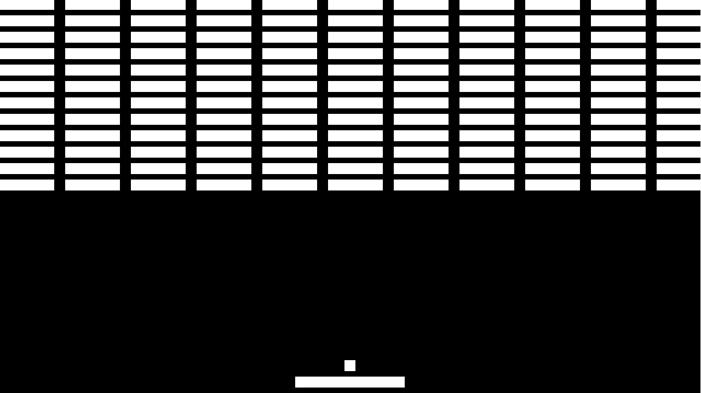
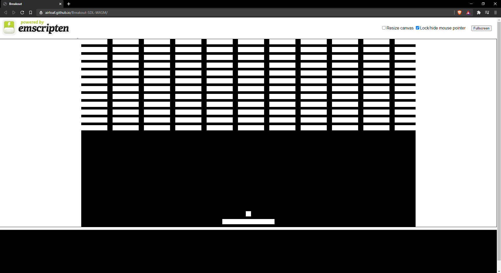

# Breakout SDL WASM

The classic game of Breakout written in C++ using SDL2 with support for Web Assembly.

[You can play it here!](https://airloaf.github.io/Breakout-SDL-WASM/)




## Usage

Left arrow and right arrow to move the paddle left and right.
Spacebar to launch the ball if it is held.

## Dependencies

- [SDL2](https://www.libsdl.org/)
- [CMake](https://cmake.org/)
- [Emscripten SDK (For Web Assembly builds only)](https://emscripten.org/)

## Building

### Windows

Use the CMakeLists.txt file to generate a Visual Studio solution and compile from there. Output will be in build/bin/Release.

Note: If you have Visual Studio Code on your computer, you can use the CMake Tools extension to compile and run directly within vscode.

### Linux

```
# Create Makefile build script for linux
cmake .

# Compile the project using make
make
```

### Web Assembly (Emscripten on Linux or WSL)
Ensure you have the Emscripten SDK installed on your system prior to exeucting these instructions
```
# Create Makefile build script for Web Assembly
emcmake cmake .

# Compile the project using make
emmake make
```
